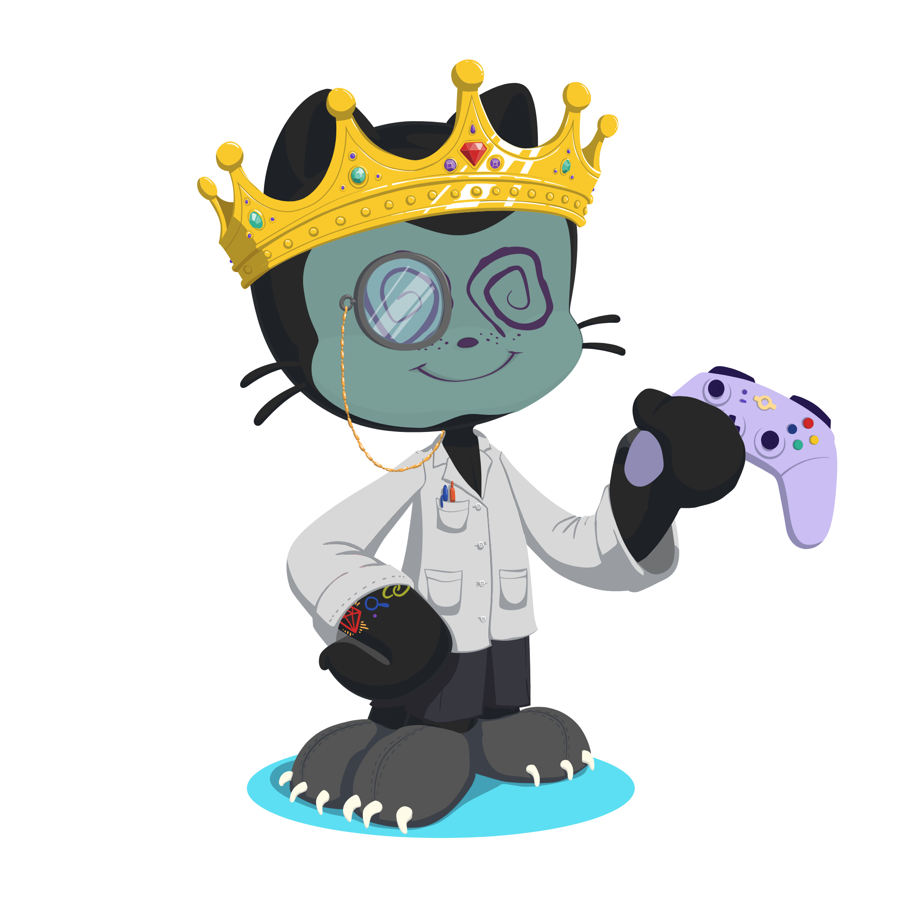

<h1 align="center">Hi there, I'm King Alfonze Mangundayao (Personal Acc :D) 👋</h1>

  

# 💫 About Me:
🔭 I’m currently working on something (js keeping myself busy and tryna learn something new) 
🌱 I’m currently learning ... 
💬 Ask me about... i don't know... anything? 
🎵 A Couple Minutes 
⚡ Fun fact: guess what...

# 💻 Tech Stack:

# 📊 GitHub Stats:

  <!-- Speed MONKA-->
  
  <!-- Laughing Cat-->
  

 

 

# 🌐 Socials:

  <!--X LINKIE-->
  
  
  <!--@Threads LINKIE-->
  

  <!--Spotify LINKIE-->
  

  <!--Steam LINKIE-->
  

  <!--Discord LINKIE-->
  

   <!--LinkedIn LINKIE-->
  

  <!--Facebook LINKIE-->
  

  <!--Instagram LINKIE-->
  
  
  

  

  
  

<!-- Proudly created with GPRM ( https://gprm.itsvg.in ) -->
